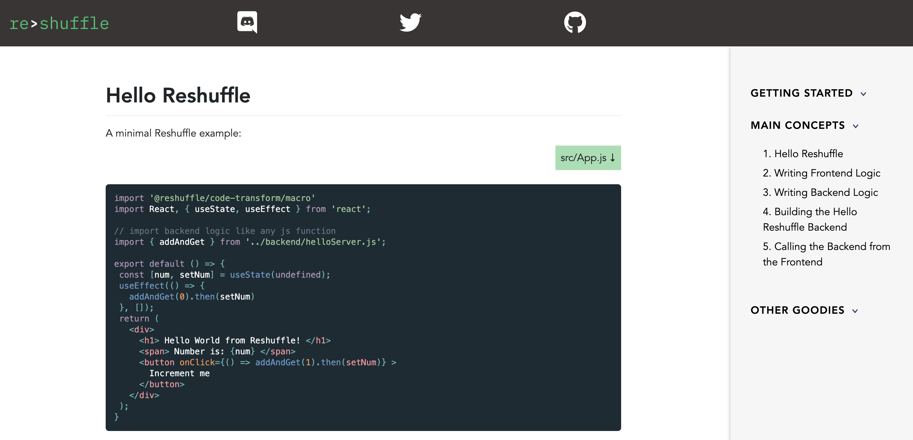

# We have terminated the backend for this project.  Old Reshuffle projects can no longer be deployed.

Dev docs site of Reshuffle. Uses remark, rehype and prismjs to render markdown with syntax highlighting (even for JSX). Syntax style is directly borrowed from [ReactJS](reactjs.org).

Content management is possible using hidden `'/editor'` route. To use this route, the following env vars need to exist on deploy

```

VALID_HOSTED_DOMAIN= // email address domain allowed for admins

REACT_APP_OAUTH_CLIENT_ID= // https://developers.google.com/identity/protocols/OAuth2

REACT_APP_AUTH_NAME= // what is the name to display when asking for auth

REACT_APP_GA_TRACKING_ID (optional)= // tracking Id of your Google Analytics project
```

> Note: When using Create-React-App any env-var starting with REACT_APP will be injected (permanently) into the client code

Once authenticated, posts can be created/updated using drop-down selection and correctly configured frontmatter.

Keywords: javascript, react, create-react-app, fullstack, bootstrap, backend, markdown, prism, remark, rehype, reactjs

This project was bootstrapped with [Create React App](https://github.com/facebook/create-react-app).

## Screenshot


